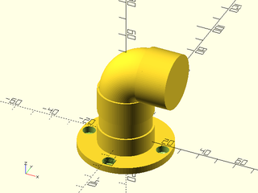

# openscad_pvc
Modules and functions to create PVC pipe models within OpenSCAD

Models have their dimensions and sizes pulled from existing specifications, organized by PVC schedule and size, so they should be sized the same as parts found in a hardware store. PVC parts modeled here come with simple BOSL2 attachable endpoints, so joining parts together relatively easy when constructing pipe layouts or new component parts.

# Usage

Models start by selecting a PVC specification. A range of public PVC specifications are inline to the library: they define diameters and thicknesses and thread sizing for existing piping. 

Once a specification is selected, it can be reused over and over to create individual PVC parts. 

Individual PVC parts can be quickly modeled and attached to each other using BOSL2's Attachment feature. 

A simple example:

```
pvc = pvc_spec_lookup(schedule=40, dn="DN20");
pvc_flange(pvc)
    attach("B", "A")
        pvc_pipe(pvc, 30)
            attach("B", "A")
                pvc_elbow(pvc, 90)
                    attach("B", "A")
                        pvc_cap(pvc);
```
...would yield something that looks like:



There's other examples in [the examples directory](examples/), and a full overview on selecting PVC specifications by schedule, and on joining individual PVC parts, can be found in [the docs](docs/openscad_pvc.scad.md).

# Installation

Installing this library should be as simple as downloading the .scad file and copying it to your OpenSCAD library directory:
```
wget -N -q -O openscad_pvc.scad https://raw.githubusercontent.com/jon-gilbert/openscad_pvc/main/openscad_pvc.scad
```
The library directory will vary based on your OS; see https://en.wikibooks.org/wiki/OpenSCAD_User_Manual/Libraries#Library_locations for the correct location for you.

## Required OpenSCAD Version
Building and using the `openscad_pvc` library requires OpenSCAD 2021.01 or later. Visit https://openscad.org/ for installation instructions.

## Requried External Libraries

### BOSL2
Belfry OpenSCAD Library (v.2). Authored by a number of contributors. Located at https://github.com/revarbat/BOSL2

To download this library, follow the instructions provided at https://github.com/revarbat/BOSL2#installation

### openscad_objects: object_common_functions.scad
Objectifed OpenSCAD library. Authored by Jonathan Gilbert. Located at https://github.com/jon_gilbert/openscd_objects 

To download this library, 
```
wget -N -q -O object_common_functions.scad https://raw.githubusercontent.com/jon-gilbert/openscad_objects/main/object_common_functions.scad
```
...and copy it to OpenSCAD's library directory.


