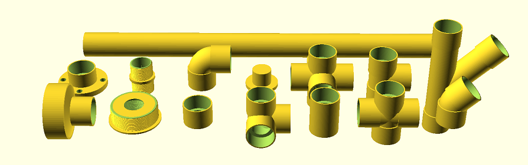

# openscad_pvc
Modules and functions to create PVC pipe models within OpenSCAD

Models have their dimensions and sizes pulled from existing specifications, organized by PVC schedule and size, so they should be sized the same as parts found in a hardware store. PVC parts modeled here come with simple BOSL2 attachable endpoints, so joining parts together relatively easy when constructing pipe layouts or new component parts.

```openscad
pvc = pvc_spec_lookup(schedule=40, dn="DN20");
pvc_flange(pvc)
    attach("B", "A")
        pvc_pipe(pvc, 30)
            attach("B", "A")
                pvc_elbow(pvc, 90)
                    attach("B", "A")
                        pvc_cap(pvc);
```
...would yield something that looks like:


# Installation
Installing this library should be as simple as downloading the .scad file and copying it to your OpenSCAD library directory:
```
wget -N -q -O openscad_pvc.scad https://raw.githubusercontent.com/jon-gilbert/openscad_pvc/main/openscad_pvc.scad
```
Additional information on external libraries needed can be found at [the Installation wiki](https://github.com/jon-gilbert/openscad_pvc/wiki/Installation).

