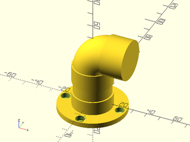
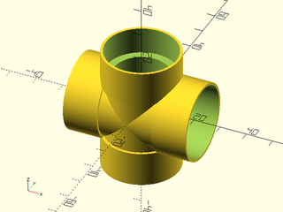

# LibFile: openscad\_pvc.scad

Modules and functions to create PVC pipe models within OpenSCAD. Models have their
dimensions and sizes pulled from existing specifications, organized by PVC schedule
and size, so they should be sized the same as parts found in a hardware store.
PVC parts modeled here come with simple BOSL2 attachable endpoints, so joining parts
together relatively easy when constructing pipe layouts or new component parts.

To use, add the following lines to the beginning of your file:

    include <openscad_pvc.scad>

## Table of Contents

1. [Section: PVC Specification Selection](#section-pvc-specification-selection)
    - [`pvc_spec_lookup()`](#function-pvc_spec_lookup)

2. [Section: PVC Component Part Modules](#section-pvc-component-part-modules)
    - [`pvc_pipe()`](#module-pvc_pipe)
    - [`pvc_elbow()`](#module-pvc_elbow)
    - [`pvc_wye()`](#module-pvc_wye)
    - [`pvc_tee()`](#module-pvc_tee)
    - [`pvc_corner()`](#module-pvc_corner)
    - [`pvc_side_outlet_tee()`](#module-pvc_side_outlet_tee)
    - [`pvc_cross()`](#module-pvc_cross)
    - [`pvc_six_way_joint()`](#module-pvc_six_way_joint)
    - [`pvc_coupling()`](#module-pvc_coupling)
    - [`pvc_cap()`](#module-pvc_cap)
    - [`pvc_plug()`](#module-pvc_plug)
    - [`pvc_adapter()`](#module-pvc_adapter)
    - [`pvc_bushing()`](#module-pvc_bushing)
    - [`pvc_nipple()`](#module-pvc_nipple)
    - [`pvc_flange()`](#module-pvc_flange)

3. [Section: Constants](#section-constants)
    - [`PVC_KNOWN_SCHEDULES`](#constant-pvc_known_schedules)
    - [`PVC_ENDTYPES`](#constant-pvc_endtypes)
    - [`PVC_DEFAULT_ANCHOR`](#constant-pvc_default_anchor)
    - [`PVC_DEFAULT_SPIN`](#constant-pvc_default_spin)
    - [`PVC_DEFAULT_ORIENT`](#constant-pvc_default_orient)


## Section: PVC Specification Selection

To get consistent dimensions for parts and components when modeling PVC, you have to
know the diameter and threading information for the size of PVC you're working with.
Those dimensions are driven not only by the diameter of the pipe you're using, but
the schedule rating for that pipe. There's dozens of sizes across the PVC schedules,
and rather than make you look it all up, *those dimensions are pre-compiled and
provided here.*

Selecting the specification you want is made easy with `pvc_spec_lookup()`, which
gives you a PVC object - a self-contained block of dimension information that you can
pass to the part modules below as an argument. If you're working with multiple sizes
of PVC pipe, that's ok: you can lookup and use as many different specifications within
your .scad as you need.

In its most common usage, you call `pvc_spec_lookup()` to get the specs for
a pipe of a particular size and schedule, then use those specs to create one or
more parts to join together, something akin to:
```
pvc = pvc_spec_lookup(40, name="1/4");
pvc_elbow(pvc)
   attach("A", "B")
     pvc_pipe(pvc);
```

### Function: pvc\_spec\_lookup()

**Usage:** 

- pvc = pvc\_spec\_lookup(schedule, &lt;name=undef&gt;, &lt;dn=undef&gt;, &lt;od=undef&gt;, &lt;wall=undef&gt;);

**Description:** 

Given a PVC schedule `schedule` and one or more named selectors, search through the `PVC_Specs` list
constant and find the PVC object whose attributes match the schedule and selectors, and
return the PVC object `pvc`.

The `pvc` object is then suitable for use throughout the modules in this library.

It is possible to call `pvc_spec_lookup()` with valid arguments and have no matching PVC object returned.
For example, `pvc_spec_lookup(40, name="1/8")` should correctly return the schedule-40 pipe spec for DN8,
a 1/8-inch-diameter pipe; however, `pvc_spec_lookup(120, name="1/8")` will return an error, because schedule-120
doesn't have a 1/8-inch-diameter pipe. In these cases, `pvc_spec_lookup()` will throw an assertion error.

It may be possible to call `pvc_spec_lookup()` with valid arguments and have multiple matching PVC objects returned.
For example, `pvc_spec_lookup(40, wall=2.4)` may return two different small-diameter piping specifications.
In these cases, `pvc_spec_lookup()` will throw an assertion error.

**Arguments:** 

<abbr title="These args can be used by position or by name.">By&nbsp;Position</abbr> | What it does
-------------------- | ------------
`schedule`           | A PVC schedule, one of `PVC_KNOWN_SCHEDULES`, as a number. No default

<abbr title="These args must be used by name, ie: name=value">By&nbsp;Name</abbr> | What it does
-------------------- | ------------
`name`               | The nominal "name" of the PVC size (eg, `3/8`, `1`, `2 1/2`), as a character string. Default: `undef`
`dn`                 | The "DN" specifier of the PVC size (eg, `DN10`, `DN125`), as a character string. Default: `undef`
`od`                 | The outer-diameter of the PVC, in `mm` (eg, `10.3`). Default: `undef`
`wall`               | The wall thickness of the PVC, in `mm` (eg, `2.41`). Default: `undef`


It is an error to call `pvc_spec_lookup()` with a schedule that isn't listed in `PVC_KNOWN_SCHEDULES`.

It is an error to call `pvc_spec_lookup()` without at least *one* of `name`, `dn`, `od`, or `wall` defined.

**Example 1:** a basic lookup example using the nominal PVC size

    include <openscad_pvc.scad>
    pvc = pvc_spec_lookup(40, name="3/4");
    echo( obj_debug_obj(pvc) );
    // ...yields:
    // ECHO: "0: _toc_: PVC
    // 1: schedule (i): 40
    // 2: name (s): 3/4
    // 3: od (i): 26.7
    // 4: wall (i): 2.87
    // 5: dn (s): DN20
    // 6: tl (i: 10): undef
    // 7: pitch (i: 0.9407): undef"

<br clear="all" /><br/>

**Example 2:** a basic lookup example using the "DN" of the specification

    include <openscad_pvc.scad>
    pvc = pvc_spec_lookup(40, dn="DN20");
    echo( obj_debug_obj(pvc) );
    // ...yields:
    // ECHO: "0: _toc_: PVC
    // 1: schedule (i): 40
    // 2: name (s): 3/4
    // 3: od (i): 26.7
    // 4: wall (i): 2.87
    // 5: dn (s): DN20
    // 6: tl (i: 10): undef
    // 7: pitch (i: 0.9407): undef"

<br clear="all" /><br/>

**Example 3:** lookup a basic specification, and use that object to make a pipe that is 30mm long:


    include <openscad_pvc.scad>
    pvc = pvc_spec_lookup(40, dn="DN20");
    pvc_pipe(pvc, 30);

<br clear="all" /><br/>

---

## Section: PVC Component Part Modules

These are modules that produce PVC parts such as pipes, elbows, and tees.

All of the part modules require at least one PVC object. See the above function
`pvc_spec_lookup()` for details on how to select a PVC object with which
to work.

In all cases, they provide BOSL2-attaching and positioning. If you're unfamiliar with how
attachables and anchoring works within BOSL2, a good (but dense) starting point can
be found at https://github.com/revarbat/BOSL2/wiki/Tutorial-Attachments .  The
common module arguments `anchor`, `spin`, and `orient` all work the same way, and
they work in the manner described in that attachments tutorial.

In their most simple form, parts are joined by attaching one to another. For example,
creating a simple flange-pipe-elbow-cap layout is as simple as:
```
pvc = pvc_spec_lookup(schedule=40, dn="DN20");
pvc_flange(pvc)
    attach("B", "A")
        pvc_pipe(pvc, 30)
            attach("B", "A")
                pvc_elbow(pvc, 90)
                    attach("B", "A")
                        pvc_cap(pvc);
```
...yielding something that looks like:

**Figure 1:** 



<br clear="all" /><br/>

### Module: pvc\_pipe()

**Usage:** 

- pvc\_pipe(pvc, length);
- pvc\_pipe(pvc, length, &lt;ends=["spigot", "spigot"]&gt;, &lt;anchor=CENTER&gt;, &lt;spin=0&gt;, &lt;orient=UP&gt;);

**Description:** 

Given a PVC object `pvc` and a length `length`, create a PVC pipe `length` long, with the
dimensions provided in the `pvc` object.

The pipe model will have two named anchors, `A`, and `B`. When oriented `UP` (the default),
`A` will be the endpoint at the bottom of the pipe, and `B` will be at its top.
Anchors are inset one-half of the PVC's thread-length, making joining with other
parts simple (eg, `pvc_pipe(p, 10) attach("A", "A") pvc_elbow(pvc)`).

**Arguments:** 

<abbr title="These args can be used by position or by name.">By&nbsp;Position</abbr> | What it does
-------------------- | ------------
`pvc`                | An instantiated PVC specification
`length`             | The length of the pipe

<abbr title="These args must be used by name, ie: name=value">By&nbsp;Name</abbr> | What it does
-------------------- | ------------
`ends`               | A list of the two end types, `A` and `B`. Default: `["spigot", "spigot"]`
`anchor`             | Translate so anchor point is at origin `[0,0,0]`. Default: `PVC_DEFAULT_ANCHOR`
`spin`               | Rotate this many degrees around the Z axis after anchoring. Default: `PVC_DEFAULT_SPIN`
`orient`             | Vector direction to which the model should point after spin. Default: `PVC_DEFAULT_ORIENT`

**Named Anchors:** 

Anchor Name | Position Description
----------- | --------------------
`A`                  | One of the two endpoints of the pipe, positioned at its bottom, oriented downwards
`B`                  | One of the two endpoints of the pipe, positioned at its top, oriented upwards

**Figure 1:** Available named anchors


<br clear="all" />


It is not an error to specify end types other than "spigot" for pipes; however, it's
not really a thing that happens a lot in the real world, y'know? You don't really
see a lot of threaded pipes: you see pipes that are mated to parts that have threads.
`pvc_pipe()` won't throw an error if one of your ends isn't a spigot, but I'd try to avoid it.

**Todo:** 

- When the merge at https://github.com/openscad/openscad/pull/4185 is released to general-availability, reenable the animated spin of the model in Figure-1 here, and throughout the other part modules in this library.

**Example 1:** a basic pipe


    include <openscad_pvc.scad>
    pvc_pipe(pvc_a, 30);

<br clear="all" /><br/>

---

### Module: pvc\_elbow()

**Usage:** 

- pvc\_elbow(pvc, angle);
- pvc\_elbow(pvc, angle, &lt;ends=["socket", "socket"]&gt;, &lt;anchor=CENTER&gt;, &lt;spin=0&gt;, &lt;orient=UP&gt;);

**Description:** 

Given a PVC object `pvc`, and a bending number of degrees `angle`, create a
PVC elbow component. `angle` can be any reasonable number of degrees including `180`,
though beyond that and the viability of the elbow is questionable.

The elbow will have two named anchors `A` and `B`. When oriented `UP` (the default),
`A` will be the endpoint at the bottom of the elbow, and `B` will be at whatever
angle the elbow outputs.
The `ends` list argument specifies what endtypes will be created for the `A` and `B`
pipe ends, respectively. If `ends` is unspecified, or if any of the positional
list elements are `undef`, then those unspecified ends will be a socket.

**Arguments:** 

<abbr title="These args can be used by position or by name.">By&nbsp;Position</abbr> | What it does
-------------------- | ------------
`pvc`                | An instantiated PVC specification
`angle`              | The angle in degrees to bend the elbow

<abbr title="These args must be used by name, ie: name=value">By&nbsp;Name</abbr> | What it does
-------------------- | ------------
`ends`               | A list of the two end types, `A` and `B`. Default: `["socket", "socket"]`
`anchor`             | Translate so anchor point is at origin `[0,0,0]`. Default: `PVC_DEFAULT_ANCHOR`
`spin`               | Rotate this many degrees around the Z axis after anchoring. Default: `PVC_DEFAULT_SPIN`
`orient`             | Vector direction to which the model should point after spin. Default: `PVC_DEFAULT_ORIENT`

**Named Anchors:** 

Anchor Name | Position Description
----------- | --------------------
`A`                  | One of the two endpoints of the pipe, positioned at its bottom, oriented downwards
`B`                  | One of the two endpoints of the pipe, angled to the right, oriented at `angle` degrees

**Figure 1:** Available named anchors


<br clear="all" />


Because of the odd shape for this model, the cardinal anchoring points for `pvc_elbow` won't
reflect the full envelope of the model; don't assume anchoring `RIGHT` or `TOP` will be at the models
rightmost or topmost position.

**Example 1:** a basic elbow


    include <openscad_pvc.scad>
    pvc_elbow(pvc_a, 45);

<br clear="all" /><br/>

**Example 2:** an 90-degree elbow with female threads


    include <openscad_pvc.scad>
    pvc_elbow(pvc_a, 90, ends=["fipt", "fipt"]);

<br clear="all" /><br/>

---

### Module: pvc\_wye()

**Usage:** 

- pvc\_wye(pvc);
- pvc\_wye(pvc, &lt;ends=["socket", "socket", "socket"]&gt;, &lt;anchor=CENTER&gt;, &lt;spin=0&gt;, &lt;orient=UP&gt;);

**Description:** 

Given a PVC object, create a wye PVC part: essentially, a pipe with two endpoints, and a
segment of pipe jutting out at 45-degrees from the center ending in a third endpoint.

The wye will have three named anchors, `A`, `B`, `C`. When oriented `UP` (the default),
`A` will be the endpoint at the bottom of the wye, `B` will be at its top, and `C` will
be the extension angling to the right.
The `ends` list argument specifies what endtypes will be created for `A`, `B`, `C` endtypes,
respectively. Absent endtypes from `ends` will default to "socket".

**Arguments:** 

<abbr title="These args can be used by position or by name.">By&nbsp;Position</abbr> | What it does
-------------------- | ------------
`pvc`                | An instantiated PVC specification

<abbr title="These args must be used by name, ie: name=value">By&nbsp;Name</abbr> | What it does
-------------------- | ------------
`ends`               | A list of the three end types, `A`, `B`, & `C`. Default: `["socket", "socket", "socket"]`
`anchor`             | Translate so anchor point is at origin `[0,0,0]`. Default: `PVC_DEFAULT_ANCHOR`
`spin`               | Rotate this many degrees around the Z axis after anchoring. Default: `PVC_DEFAULT_SPIN`
`orient`             | Vector direction to which the model should point after spin. Default: `PVC_DEFAULT_ORIENT`

**Named Anchors:** 

Anchor Name | Position Description
----------- | --------------------
`A`                  | One of the two endpoints of the main pipe, positioned at its bottom, oriented downwards
`B`                  | One of the two endpoints of the main pipe, positioned at its top, oriented upwards
`C`                  | The right-hand out-jutting endpoint, angled to the right, oriented upwards at 45-degrees

**Figure 1:** Available named anchors


<br clear="all" /><br/>


Because of the odd shape for this model, the cardinal anchoring points for `pvc_wye()` won't
reflect the full envelope of the model; don't assume anchoring `RIGHT` or `TOP` will be at the models
rightmost or topmost position.

**Example 1:** a simple wye


    include <openscad_pvc.scad>
    pvc_wye(pvc_a);

<br clear="all" /><br/>

---

### Module: pvc\_tee()

**Usage:** 

- pvc\_tee(pvc);
- pvc\_tee(pvc, &lt;ends=["socket", "socket", "socket"]&gt;, &lt;anchor=CENTER&gt;, &lt;spin=0&gt;, &lt;orient=UP&gt;);

**Description:** 

Given a PVC object `pvc`, create a PVC tee component. A tee is essentially a length of pipe
with a outspout extending to the right at 90-degrees.

The tee will have three named anchors, `A`, `B`, `C`. When oriented `UP` (the default),
`A` will be the endpoint at the bottom of the tee, `B` will be at its top, and `C` will
be the extension to the right.
The `ends` list argument specifies what endtypes will be created for `A`, `B`, `C` endtypes,
respectively. Absent endtypes from `ends` will default to "socket".

**Arguments:** 

<abbr title="These args can be used by position or by name.">By&nbsp;Position</abbr> | What it does
-------------------- | ------------
`pvc`                | An instantiated PVC specification

<abbr title="These args must be used by name, ie: name=value">By&nbsp;Name</abbr> | What it does
-------------------- | ------------
`ends`               | A list of the three end types, `A`, `B`, & `C`. Default: `["socket", "socket", "socket"]`
`anchor`             | Translate so anchor point is at origin `[0,0,0]`. Default: `PVC_DEFAULT_ANCHOR`
`spin`               | Rotate this many degrees around the Z axis after anchoring. Default: `PVC_DEFAULT_SPIN`
`orient`             | Vector direction to which the model should point after spin. Default: `PVC_DEFAULT_ORIENT`

**Named Anchors:** 

Anchor Name | Position Description
----------- | --------------------
`A`                  | One of the two endpoints of the main pipe, positioned at its bottom, oriented downwards
`B`                  | One of the two endpoints of the main pipe, positioned at its top, oriented upwards
`C`                  | The right-hand out-jutting endpoint, angled to the right, oriented rightwards

**Figure 1:** Available named anchors


<br clear="all" /><br/>


Because of the odd shape for this model, the cardinal anchoring points for `pvc_tee()` won't
reflect the full envelope of the model; don't assume anchoring `RIGHT` or `LEFT` will be at the models
rightmost or leftmost position.

**Example 1:** a simple tee


    include <openscad_pvc.scad>
    pvc_tee(pvc_a);

<br clear="all" /><br/>

**Example 2:** a tee with a variety of end types


    include <openscad_pvc.scad>
    pvc_tee(pvc_a, ends=["socket", "mipt", "fipt"]);

<br clear="all" /><br/>

---

### Module: pvc\_corner()

**Usage:** 

- pvc\_corner(pvc);
- pvc\_corner(pvc, &lt;ends=["socket", "socket", "socket"]&gt;, &lt;anchor=CENTER&gt;, &lt;spin=0&gt;, &lt;orient=UP&gt;);

**Description:** 

Given a PVC object, create a corner part. A corner is three endpoints at 90-degrees from
each other, pointing forward, upwards, and rightwards.

The corner will have three named anchors, `A`, `B`, `C`. When oriented `UP` (the default),
`A` will be the endpoint at the front of the corner, `B` will be at its top, and `C` will
be pointing to the right.
The `ends` list argument specifies what endtypes will be created for `A`, `B`, `C` endtypes,
respectively. Absent endtypes from `ends` will default to "socket".

**Arguments:** 

<abbr title="These args can be used by position or by name.">By&nbsp;Position</abbr> | What it does
-------------------- | ------------
`pvc`                | An instantiated PVC specification

<abbr title="These args must be used by name, ie: name=value">By&nbsp;Name</abbr> | What it does
-------------------- | ------------
`ends`               | A list of the three end types, `A`, `B`, & `C`. Default: `["socket", "socket", "socket"]`
`anchor`             | Translate so anchor point is at origin `[0,0,0]`. Default: `PVC_DEFAULT_ANCHOR`
`spin`               | Rotate this many degrees around the Z axis after anchoring. Default: `PVC_DEFAULT_SPIN`
`orient`             | Vector direction to which the model should point after spin. Default: `PVC_DEFAULT_ORIENT`

**Named Anchors:** 

Anchor Name | Position Description
----------- | --------------------
`A`                  | One of the three endpoints of the corner, positioned at its front, oriented forwards
`B`                  | One of the three endpoints of the corner, positioned at its top, oriented upwards
`C`                  | One of the three endpoints of the corner, position to the right, oriented rightwards

**Figure 1:** Available named anchors


<br clear="all" />


Because of the odd shape for this model, the cardinal anchoring points for `pvc_corner()` won't
reflect the full envelope of the model; don't assume anchoring `RIGHT` or `TOP` will be at the models
rightmost or topmost position.

**Example 1:** a simple corner


    include <openscad_pvc.scad>
    pvc_corner(pvc_a);

<br clear="all" /><br/>

---

### Module: pvc\_side\_outlet\_tee()

**Usage:** 

- pvc\_side\_outlet\_tee(pvc);
- pvc\_side\_outlet\_tee(pvc, &lt;ends=["socket", "socket", "socket", "socket"]&gt;, &lt;anchor=CENTER&gt;, &lt;spin=0&gt;, &lt;orient=UP&gt;);

**Description:** 

Given a PVC object `pvc`, create a PVC tee component. A tee is essentially a length of pipe
with a out-spout extending to the right at 90-degrees; a side outlet tee is a tee with an
out-spout extending forward at 90-degrees.

The tee will have four named anchors, `A`, `B`, `C`, `D`. When oriented `UP` (the default),
`A` will be the endpoint at the bottom of the tee, `B` will be at its top, and `C` will
be the extension to the right, and `D` will be the extension facing forward.
The `ends` list argument specifies what endtypes will be created for `A`, `B`, `C`, `D` endtypes,
respectively. Absent endtypes from `ends` will default to "socket".

**Arguments:** 

<abbr title="These args can be used by position or by name.">By&nbsp;Position</abbr> | What it does
-------------------- | ------------
`pvc`                | An instantiated PVC specification

<abbr title="These args must be used by name, ie: name=value">By&nbsp;Name</abbr> | What it does
-------------------- | ------------
`ends`               | A list of the four end types, `A`, `B`, `C`, & `D`. Default: `["socket", "socket", "socket", "socket"]`
`anchor`             | Translate so anchor point is at origin `[0,0,0]`. Default: `PVC_DEFAULT_ANCHOR`
`spin`               | Rotate this many degrees around the Z axis after anchoring. Default: `PVC_DEFAULT_SPIN`
`orient`             | Vector direction to which the model should point after spin. Default: `PVC_DEFAULT_ORIENT`

**Named Anchors:** 

Anchor Name | Position Description
----------- | --------------------
`A`                  | One of the two endpoints of the main pipe, positioned at its bottom, oriented downwards
`B`                  | One of the two endpoints of the main pipe, positioned at its top, oriented upwards
`C`                  | The right-hand out-jutting endpoint, angled to the right, oriented rightwards
`D`                  | The forwad-facing out-jutting endpoint, angled to forward, oriented forwards

**Figure 1:** Available named anchors


<br clear="all" />


Because of the odd shape for this model, the cardinal anchoring points for `pvc_side_outlet_tee()` won't
reflect the full envelope of the model; don't assume anchoring `RIGHT` or `FWD` will be at the models
rightmost or foremost position.

**Example 1:** a simple tee


    include <openscad_pvc.scad>
    pvc_side_outlet_tee(pvc_a);

<br clear="all" /><br/>

**Example 2:** a tee with a variety of end types


    include <openscad_pvc.scad>
    pvc_side_outlet_tee(pvc_a, ends=["socket", "mipt", "fipt"]);

<br clear="all" /><br/>

---

### Module: pvc\_cross()

**Usage:** 

- pvc\_cross(pvc);
- pvc\_cross(pvc, &lt;ends=["socket", "socket", "socket", "socket"]&gt;, &lt;anchor=CENTER&gt;, &lt;spin=0&gt;, &lt;orient=UP&gt;);

**Description:** 

Given a PVC object `pvc`, create a PVC cross component. A cross is essentially two lengths of pipe
joined together in their center at right angles, with four outlets.

The cross will have four named anchors, `A`, `B`, `C`, `D`. When oriented `UP` (the default),
`A` will be the endpoint at the bottom of the cross, `B` will be at its top, and `C` will
be to the right, and `D` will be to the left.
The `ends` list argument specifies what endtypes will be created for `A`, `B`, `C`, `D` endtypes,
respectively. Absent endtypes from `ends` will default to "socket".

**Arguments:** 

<abbr title="These args can be used by position or by name.">By&nbsp;Position</abbr> | What it does
-------------------- | ------------
`pvc`                | An instantiated PVC specification

<abbr title="These args must be used by name, ie: name=value">By&nbsp;Name</abbr> | What it does
-------------------- | ------------
`ends`               | A list of the four end types, `A`, `B`, `C`, & `D`. Default: `["socket", "socket", "socket", "socket"]`
`anchor`             | Translate so anchor point is at origin `[0,0,0]`. Default: `PVC_DEFAULT_ANCHOR`
`spin`               | Rotate this many degrees around the Z axis after anchoring. Default: `PVC_DEFAULT_SPIN`
`orient`             | Vector direction to which the model should point after spin. Default: `PVC_DEFAULT_ORIENT`

**Named Anchors:** 

Anchor Name | Position Description
----------- | --------------------
`A`                  | One of the two endpoints of the main pipe, positioned at its bottom, oriented downwards
`B`                  | One of the two endpoints of the main pipe, positioned at its top, oriented upwards
`C`                  | The right-hand out-jutting endpoint, angled to the right, oriented rightwards
`D`                  | The left-hand out-jutting endpoint, angled to the left, oriented leftwards

**Figure 1:** Available named anchors


<br clear="all" />


Because of the odd shape for this model, the cardinal anchoring points for `pvc_cross()` won't
reflect the full envelope of the model; don't assume anchoring `RIGHT` or `FWD` will be at the models
rightmost or foremost position.

**Example 1:** a simple tee



    include <openscad_pvc.scad>
    pvc_cross(pvc_a);

<br clear="all" /><br/>

**Example 2:** a tee with a variety of end types


    include <openscad_pvc.scad>
    pvc_cross(pvc_a, ends=["socket", "mipt", "fipt", "spigot"]);

<br clear="all" /><br/>

---

### Module: pvc\_six\_way\_joint()

**Usage:** 

- pvc\_six\_way\_joint(pvc);
- pvc\_six\_way\_joint(pvc, &lt;ends=["socket", ...]&gt;, &lt;anchor=CENTER&gt;, &lt;spin=0&gt;, &lt;orient=UP&gt;);

**Description:** 

Given a PVC object `pvc`, create a PVC six-way joint component. A six-way is essentially three lengths of pipe
joined together in their center at right angles, with six outlets.

The cross will have four named anchors, `A`, `B`, `C`, `D`, `E`, `F`. When oriented `UP` (the default),
`A` will be the endpoint at the bottom of the cross, `B` will be at its top, `C` will
be to the right, `D` will be to the left, `E` will be facing forwards, and `F` will be facing backwards.
The `ends` list argument specifies what endtypes will be created for `A`, `B`, `C`, `D`, `E`, `F` endtypes,
respectively. Absent endtypes from `ends` will default to "socket".

**Arguments:** 

<abbr title="These args can be used by position or by name.">By&nbsp;Position</abbr> | What it does
-------------------- | ------------
`pvc`                | An instantiated PVC specification

<abbr title="These args must be used by name, ie: name=value">By&nbsp;Name</abbr> | What it does
-------------------- | ------------
`ends`               | A list of the six end types, `A`, `B`, `C`, `D`, `E`, & `F`. Default: `["socket", ...]`
`anchor`             | Translate so anchor point is at origin `[0,0,0]`. Default: `PVC_DEFAULT_ANCHOR`
`spin`               | Rotate this many degrees around the Z axis after anchoring. Default: `PVC_DEFAULT_SPIN`
`orient`             | Vector direction to which the model should point after spin. Default: `PVC_DEFAULT_ORIENT`

**Named Anchors:** 

Anchor Name | Position Description
----------- | --------------------
`A`                  | One of the six endpoints of the joint, positioned at its bottom, oriented downwards
`B`                  | One of the six endpoints of the joint, positioned at its top, oriented upwards
`C`                  | The right-hand out-jutting endpoint, angled to the right, oriented rightwards
`D`                  | The left-hand out-jutting endpoint, angled to the left, oriented leftwards
`E`                  | The foward-facing out-jutting endpoint, oriented forwards
`F`                  | The backward-facing out-jutting endpoint, oriented backwards

**Figure 1:** Available named anchors


<br clear="all" />


Because of the odd shape for this model, the cardinal anchoring points for `pvc_six_way_joint()` won't
reflect the full envelope of the model; don't assume anchoring `RIGHT` or `FWD` will be at the models
rightmost or foremost position.

**Example 1:** a simple tee


    include <openscad_pvc.scad>
    pvc_six_way_joint(pvc_a);

<br clear="all" /><br/>

**Example 2:** a tee with a variety of end types


<br clear="all" />

    include <openscad_pvc.scad>
    pvc_six_way_joint(pvc_a, ends=["socket", "mipt", "fipt", "spigot"]);

---

### Module: pvc\_coupling()

**Usage:** 

- pvc\_coupling(pvc);
- pvc\_coupling(pvc, &lt;ends=["socket", "socket"]&gt;, &lt;anchor=CENTER&gt;, &lt;spin=0&gt;, &lt;orient=UP&gt;);

**Description:** 

Given a PVC object `pvc`, create a PVC coupler. A coupler is a part that joins two
lengths of pipes or two parts, usually with socket or fipt ends.

The coupler will have two named anchors `A` and `B`. When oriented `UP` (the default),
`A` will be the endpoint at the bottom of the coupler, and `B` will be at its top.
The `ends` list argument specifies what endtypes will be created for the `A` and `B`
pipe ends, respectively. If `ends` is unspecified, or if any of the positional
list elements are `undef`, then those unspecified ends will be a socket.

**Arguments:** 

<abbr title="These args can be used by position or by name.">By&nbsp;Position</abbr> | What it does
-------------------- | ------------
`pvc`                | An instantiated PVC specification

<abbr title="These args must be used by name, ie: name=value">By&nbsp;Name</abbr> | What it does
-------------------- | ------------
`ends`               | A list of the two end types, `A` and `B`. Default: `["socket", "socket"]`
`anchor`             | Translate so anchor point is at origin `[0,0,0]`. Default: `PVC_DEFAULT_ANCHOR`
`spin`               | Rotate this many degrees around the Z axis after anchoring. Default: `PVC_DEFAULT_SPIN`
`orient`             | Vector direction to which the model should point after spin. Default: `PVC_DEFAULT_ORIENT`

**Named Anchors:** 

Anchor Name | Position Description
----------- | --------------------
`A`                  | One of the two endpoints of the coupling, positioned at its bottom, oriented downwards
`B`                  | One of the two endpoints of the coupling, positioned at its top, oriented upwards

**Figure 1:** Available named anchors


<br clear="all" />


It's not an error to specify end types other than "socket" or "fipt" for couplers; however,
it's not really a thing that happens a lot in the real world. A coupler with two "mipt"
ends is a nipple (see `pvc_nipple()` below); and a coupler with two "spigot" ends is
just a short length of pipe with no special ends. `pvc_coupler()` won't throw an error if
the ends aren't a socket or fipt, but I'd try to avoid it.

**Example 1:** a basic coupling


    include <openscad_pvc.scad>
    pvc_coupling(pvc_a);

<br clear="all" /><br/>

**Example 2:** a coupling with female threading on each end


    include <openscad_pvc.scad>
    pvc_coupling(pvc_a, ends=["fipt", "fipt"]);

<br clear="all" /><br/>

---

### Module: pvc\_cap()

**Usage:** 

- pvc\_cap(pvc);
- pvc\_cap(pvc, &lt;ends=["socket"]&gt;, &lt;anchor=CENTER&gt;, &lt;spin=0&gt;, &lt;orient=UP&gt;);

**Description:** 

Given a PVC object `pvc`, create a cap for a PVC endpoint. A cap covers an ending of pipe or other PVC part,
wraping around the outside of the ending.

The cap model will have one named anchor, `A`. When oriented `UP` (the default), `A` will be the oriented
upwards at the top of the cap.
Anchors are inset on-half of the PVC's thread-lengh, making joining with other parts simple
(eg, `pvc_pipe(pvc) attach("A", "A") pvc_cap(pvc)`).

**Arguments:** 

<abbr title="These args can be used by position or by name.">By&nbsp;Position</abbr> | What it does
-------------------- | ------------
`pvc`                | An instantiated PVC specification

<abbr title="These args must be used by name, ie: name=value">By&nbsp;Name</abbr> | What it does
-------------------- | ------------
`ends`               | A list of the single end type, `A`. Default: `["socket"]`
`anchor`             | Translate so anchor point is at origin `[0,0,0]`. Default: `PVC_DEFAULT_ANCHOR`
`spin`               | Rotate this many degrees around the Z axis after anchoring. Default: `PVC_DEFAULT_SPIN`
`orient`             | Vector direction to which the model should point after spin. Default: `PVC_DEFAULT_ORIENT`

**Named Anchors:** 

Anchor Name | Position Description
----------- | --------------------
`A`                  | The endpoint of the cap, positioned at its top, oriented upwards

**Figure 1:** Available named anchors


<br clear="all" /><br/>


It is an error to specify an end type other than "fipt" or "socket" for caps. If you need
something to block a pipe or part ending that doesn't fit outside of the pipe's outer-diameter,
look at `pvc_plug()`.

The argument `ends` accepts a list-argument of end types, keeping the argument type
consistent with other PVC part modules, though it only considers the first element in
that list.

**Todo:** 

- a cap perhaps doesn't need to have the same wall thickness as the pipe it's being attached to.
- caps probably also have a slightly domed top. :shrug:

**Example 1:** a basic cap


    include <openscad_pvc.scad>
    pvc_cap(pvc_a);

<br clear="all" /><br/>

**Example 2:** capping a pipe


    include <openscad_pvc.scad>
    pvc_pipe(pvc_a, 30)
      attach("B", "A")
        pvc_cap(pvc_a);

<br clear="all" /><br/>

---

### Module: pvc\_plug()

**Usage:** 

- pvc\_plug(pvc);
- pvc\_plug(pvc, &lt;ends=["spigot"]&gt;, &lt;anchor=CENTER&gt;, &lt;spin=0&gt;, &lt;orient=UP&gt;);

**Description:** 

Given a PVC object `pvc`, create a plug for a PVC endpoint. A plug covers an ending of pipe or other PVC part,
sitting within the inside of the ending.

The plug model will have one named anchor, `A`. When oriented `UP` (the default), `A` will be the oriented
upwards at the top of the plug.
Anchors are inset on-half of the PVC's thread-lengh, making joining with other parts simple
(eg, `pvc_pipe(pvc) attach("A", "A") pvc_plug(pvc)`).

**Arguments:** 

<abbr title="These args can be used by position or by name.">By&nbsp;Position</abbr> | What it does
-------------------- | ------------
`pvc`                | An instantiated PVC specification

<abbr title="These args must be used by name, ie: name=value">By&nbsp;Name</abbr> | What it does
-------------------- | ------------
`ends`               | A list of the single end type, `A`. Default: `["spigot"]`
`anchor`             | Translate so anchor point is at origin `[0,0,0]`. Default: `PVC_DEFAULT_ANCHOR`
`spin`               | Rotate this many degrees around the Z axis after anchoring. Default: `PVC_DEFAULT_SPIN`
`orient`             | Vector direction to which the model should point after spin. Default: `PVC_DEFAULT_ORIENT`

**Named Anchors:** 

Anchor Name | Position Description
----------- | --------------------
`A`                  | The endpoint of the cap, positioned at its top, oriented upwards

**Figure 1:** Available named anchors


<br clear="all" />


It is an error to specify an end type other than "mipt" or "spigot" for plugs. If you need
something to block a pipe or part ending that doesn't fit inside of the pipe's inner-diameter,
look at `pvc_cap()`.

The argument `ends` accepts a list-argument of end types, keeping the argument type
consistent with other PVC part modules, though it only considers the first element in
that list.

**Todo:** 

- the top of the plug needs a way to tool-tighten, especially if the plug is threaded
- should the bottom of the plug be solid?
- plugs are meant for parts, not pipes; is this sizing too small?

**Example 1:** a basic cap


    include <openscad_pvc.scad>
    pvc_plug(pvc_a);

<br clear="all" /><br/>

**Example 2:** plugging a threaded pipe


    include <openscad_pvc.scad>
    pvc_pipe(pvc_a, 30, ends=["fipt", "fipt"])
      attach("B", "A")
        pvc_plug(pvc_a, ends=["mipt"]);

<br clear="all" /><br/>

---

### Module: pvc\_adapter()

**Usage:** 

- pvc\_adapter(pvc1, pvc2);
- pvc\_adapter(pvc1, pvc2, &lt;ends=["socket", "socket"]&gt;, &lt;anchor=CENTER&gt;, &lt;spin=0&gt;, &lt;orient=UP&gt;);

**Description:** 

Given two PVC objects `pvc1`, `pvc2`, create a PVC adapter that marries the two PVC
objects. An adapter is a part that joins pipes or parts of two different PVC sizes.

The adapter will have two named anchors `A` and `B`. When oriented `UP` (the default),
`A` will be the endpoint at the bottom of the adapter, attached to `pvc1`; and, `B` will
be the endpoint at the top of the adapter, attached to `pvc2`.
The `ends` list argument specifies what endtypes will be created for the `A` and `B`
pipe ends, respectively. If `ends` is unspecified, or if any of the positional
list elements are `undef`, then those unspecified ends will be a socket.

**Arguments:** 

<abbr title="These args can be used by position or by name.">By&nbsp;Position</abbr> | What it does
-------------------- | ------------
`pvc1`               | An instantiated PVC specification
`pvc2`               | An instantiated PVC specification

<abbr title="These args must be used by name, ie: name=value">By&nbsp;Name</abbr> | What it does
-------------------- | ------------
`ends`               | A list of the two end types, `A` and `B`. Default: `["socket", "socket"]`
`anchor`             | Translate so anchor point is at origin `[0,0,0]`. Default: `PVC_DEFAULT_ANCHOR`
`spin`               | Rotate this many degrees around the Z axis after anchoring. Default: `PVC_DEFAULT_SPIN`
`orient`             | Vector direction to which the model should point after spin. Default: `PVC_DEFAULT_ORIENT`

**Named Anchors:** 

Anchor Name | Position Description
----------- | --------------------
`A`                  | One of the two endpoints of the adapter, for `pvc1`, positioned at its bottom, oriented downwards
`B`                  | One of the two endpoints of the adapter, for `pvc2`, positioned at its top, oriented upwards

**Figure 1:** Available named anchors


<br clear="all" />


It is not an error to specify PVC objects that have identical dimensions (eg,
`pvc1` and `pvc2` both set to a schedule-40 DIM20); however, it's unclear why
you'd do that in the first place.

**Todo:** 

- I kind of dislike the socket\_overlap used here within pvc\_part\_component()

**Example 1:** a basic adapter


    include <openscad_pvc.scad>
    pvc_adapter(pvc_a, pvc_b);

<br clear="all" /><br/>

---

### Module: pvc\_bushing()

**Usage:** 

- pvc\_bushing(pvc1, pvc2);
- pvc\_bushing(pvc1, pvc2, &lt;ends=["fipt", "mipt"]&gt;, &lt;anchor=CENTER&gt;, &lt;spin=0&gt;, &lt;orient=UP&gt;);

**Description:** 

Given two PVC objects `pvc1`, `pvc2`, create a bushing that joins the two objects.
A bushing fits two dissimilar sized ends, fitting one inside the other.

The PVC objects may be supplied in any order: `pvc_bushing()` examines the diameters
of the two objects and determines which is larger or smaller, and places them
accordinging.

The bushing will have two named anchors `A` and `B`. When oriented `UP` (the default),
`A` will be the endpoint at the bottom of the bushing, attached to the smaller of the
two PVC objects; `B` will be the endpoint at the top of the bushing, attached to the
larger of the two PVC objects.
The `ends` list argument specifies what endtypes will be created for the `A` and `B`
pipe ends, respectively. If `ends` is unspecified, or if any of the positional
list elements are `undef`, then the smaller of the objects (the `A`, downward endpoint)
will be set to "fipt", and the larger of the objects (the `B`, upward endpoint) will
be set to "mipt".

While the placement of the endtypes in relation to the overall bushing model is not in
your control, it's easiest to remember: `A` comes before `B`; *smaller* elements come
before *larger* elements, say, when counting; the *smaller* of the PVC objects will be
positioned at the `A` anchor, and the larger PVC object will be positioned at the `B`
anchor.

**Arguments:** 

<abbr title="These args can be used by position or by name.">By&nbsp;Position</abbr> | What it does
-------------------- | ------------
`pvc1`               | An instantiated PVC specification
`pvc2`               | An instantiated PVC specification

<abbr title="These args must be used by name, ie: name=value">By&nbsp;Name</abbr> | What it does
-------------------- | ------------
`ends`               | A list of the two end types, `A` and `B`, corresponding to the smaller and larger PVC objects, respectively. Default: `["fipt", "mipt"]`
`anchor`             | Translate so anchor point is at origin `[0,0,0]`. Default: `PVC_DEFAULT_ANCHOR`
`spin`               | Rotate this many degrees around the Z axis after anchoring. Default: `PVC_DEFAULT_SPIN`
`orient`             | Vector direction to which the model should point after spin. Default: `PVC_DEFAULT_ORIENT`

**Named Anchors:** 

Anchor Name | Position Description
----------- | --------------------
`A`                  | One of the two endpoints of the bushing, for the larger of the PVC objects, positioned at its bottom, oriented downwards
`B`                  | One of the two endpoints of the bushing, for the smaller of the PVC objects, positioned at its top, oriented upwards

**Figure 1:** Available named anchors


<br clear="all" />


It is an error to specify two PVC objects that have identical dimensions, or
two PVC objects that cannot nest.

It is an error to specify an endtype for the smaller PVC object (the downwards, `A`, anchor) that
is neither "fipt" nor "socket".

It is an error to specify an endtype for the larger PVC object (the upwards, `B`, anchor) that
is neither "mipt" nor "spigot".

**Todo:** 

- This has some artifact extruding out of the top of the model; not sure what it is yet.
- When `B` anchor (the larger) is a spigot, there needs to be a flare at the base of the bushing to keep it from sliding in too far.
- Have a bounds check on the resulting wall thickness. If it's too little, then throw.
- I just know that the lack of ordering in PVC objects, versus the specific ordering of `ends`, is gonna come back to bite me.

**Example 1:** a basic bushing


    include <openscad_pvc.scad>
    pvc_bushing(pvc_a, pvc_b);

<br clear="all" /><br/>

---

### Module: pvc\_nipple()

**Usage:** 

- pvc\_nipple(pvc);
- pvc\_nipple(pvc, &lt;anchor=CENTER&gt;, &lt;spin=0&gt;, &lt;orient=UP&gt;);

**Description:** 

Given a PVC object `pvc`, create a PVC nipple joint model. A nipple is a length of pipe
with mipt-threads on both ends, used to join two fipt-threaded parts.

The nipple will have two named anchors `A` and `B`. When oriented `UP` (the default),
`A` will be the endpoint at the bottom of the nipple, and `B` will be at its top.


**Arguments:** 

<abbr title="These args can be used by position or by name.">By&nbsp;Position</abbr> | What it does
-------------------- | ------------
`pvc`                | An instantiated PVC specification

<abbr title="These args must be used by name, ie: name=value">By&nbsp;Name</abbr> | What it does
-------------------- | ------------
`anchor`             | Translate so anchor point is at origin `[0,0,0]`. Default: `PVC_DEFAULT_ANCHOR`
`spin`               | Rotate this many degrees around the Z axis after anchoring. Default: `PVC_DEFAULT_SPIN`
`orient`             | Vector direction to which the model should point after spin. Default: `PVC_DEFAULT_ORIENT`

**Named Anchors:** 

Anchor Name | Position Description
----------- | --------------------
`A`                  | One of the two endpoints of the nipple, positioned at its bottom, oriented downwards
`B`                  | One of the two endpoints of the nipple, positioned at its top, oriented upwards

**Figure 1:** Available named anchors


<br clear="all" />


Nipples are not for changing pipe diameters. If you need a part that has two mipt ends for
different sizes of pipe, see `pvc_adapter()`.

I dislike the name "nipple" for this PVC part, but it's what they call it at Home Depot, so it stays.

**Example 1:** a basic coupling


    include <openscad_pvc.scad>
    pvc_nipple(pvc_a);

<br clear="all" /><br/>

---

### Module: pvc\_flange()

**Usage:** 

- pvc\_flange(pvc);
- pvc\_flange(pvc, &lt;ends=[undef, "socket"]&gt;, &lt;mounts=4&gt;, &lt;mount\_diam=0&gt;, &lt;anchor=CENTER&gt;, &lt;spin=0&gt;, &lt;orient=UP&gt;);

**Description:** 

Given a PVC object `pvc`, create a flange part suitable for mounting to other flanges. A flange in
this context is a circular disk with a pipe endpoint on one side, and a flat surface on the other.
Arrayed around the pipe ending are mounting holes through which bolts may be inserted, joining the
flange to another flange that is flush-mounted.

The flange will have a `mount` number of mounting holes created. If `mount` is unspecified, it will
default to `4`. The diameter of those holes can be adjusted using `mount_diam`: if it is a positive
non-zero number, the mounting holes will be that diameter. Note that if `mount_diam` is
larger than a safe value between the outer diameter of the flange and the outer diameter of
the endtype at anchor `B`, the specified diameter will be reduced to the safe diameter.

The flange will have two named anchors `A` and `B`. When oriented `UP` (the default),
`A` will be the flush surface at the bottom of the flange, and `B` will be the endpoint on
its top, oriented upwards.
The `ends` list argument specifies what endtypes will be created for the `A` and `B`
pipe ends, respectively: only the `B` endtype is considered. If `ends` is unspecified, or if
any of the positional list elements are `undef`, then those unspecified ends will be a socket.

**Arguments:** 

<abbr title="These args can be used by position or by name.">By&nbsp;Position</abbr> | What it does
-------------------- | ------------
`pvc`                | An instantiated PVC specification

<abbr title="These args must be used by name, ie: name=value">By&nbsp;Name</abbr> | What it does
-------------------- | ------------
`ends`               | A list of the two end types, `A` and `B`. Default: `[undef, "socket"]`
`mounts`             | The number of mounting holes to array around the piping ending in the flange. Default: `4`
`mount_diam`         | The diameter of the mounting holes. Default: `0` (to let `pvc_flange()` specify the maximum safe diameter)
`anchor`             | Translate so anchor point is at origin `[0,0,0]`. Default: `PVC_DEFAULT_ANCHOR`
`spin`               | Rotate this many degrees around the Z axis after anchoring. Default: `PVC_DEFAULT_SPIN`
`orient`             | Vector direction to which the model should point after spin. Default: `PVC_DEFAULT_ORIENT`

**Named Anchors:** 

Anchor Name | Position Description
----------- | --------------------
`A`                  | The flat, underside portion of the flange, positioned at its bottom, oriented downwards
`B`                  | The pipe endpoint of the flange, positioned at its top, oriented upwards

**Figure 1:** Available named anchors


<br clear="all" />


The `A` anchor is less of a "part-joining placement" as it is a "flat surface". While
other PVC parts produced by this library place the part anchors inset in the part threading,
there is nothing like that here: just smush the flat `A` surface up against another flange's
`A` surface and you're all set. **As such,** the end type for `A` is ignored (but, it's
still part of the `ends` argument, to keep things consistent with the other modules here).

While mounting holes for joining hardware are placed into the flange, mounting
hardware is not modeled with this module; that is left as an exercise to the
user.

**Example 1:** a basic flange


    include <openscad_pvc.scad>
    pvc_flange(pvc_a);

<br clear="all" /><br/>

**Example 2:** two flanges and a pipe. A visual gap of 0.2mm is introduced between the flanges, to show their placement.


    include <openscad_pvc.scad>
    pvc_pipe(pvc_a, 30)
        attach("A", "B")
            pvc_flange(pvc_a)
                attach("A", "A", overlap=-0.2)
                    pvc_flange(pvc_a);

<br clear="all" /><br/>

---

## Section: Constants


### Constant: PVC\_KNOWN\_SCHEDULES

**Description:** 

A list of known PVC "schedules". In this context, "schedule" is what
classifies the material weight, size, and maximum pressure of PVC
part and pipe.

This list is generated dynamicaly at runtime, by scanning through
all known specifications within `_PVC_specs_raw` to extract the
unique schedules.

---

### Constant: PVC\_ENDTYPES

**Description:** 

A list of supported endtypes for PVC parts: `spigot`, `socket`, `mipt`, & `fipt`.
Spigots and sockets are smooth, allowing spigots to slide inside sockets.
mipt and fipt are male- and female-threaded endpoints.

Elements are position-dependent, because we use their position in the
`PVC_ENDTYPES` list as indicators as to whether they are "innies" or "outies".
*(ETA: yeah, um... do we?)*

*(Note: "mipt" and "fipt" are industry names. I don't like them, because they're gendered and
imply people characteristics that are assumed, and often not correct.
I'm not about to go up against the PVC industry in this .scad today, though,
no matter how much fun it'd be.)*

---

### Constant: PVC\_DEFAULT\_ANCHOR

**Description:** 

The default anchor position for creating PVC parts. Currently: `CENTER`

---

### Constant: PVC\_DEFAULT\_SPIN

**Description:** 

Default spin value used when creating PVC parts. Currently: `0` (for no spin)

---

### Constant: PVC\_DEFAULT\_ORIENT

**Description:** 

Default orientation for PVC parts. Currently: `UP`

---

