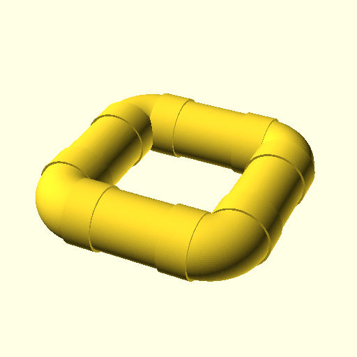
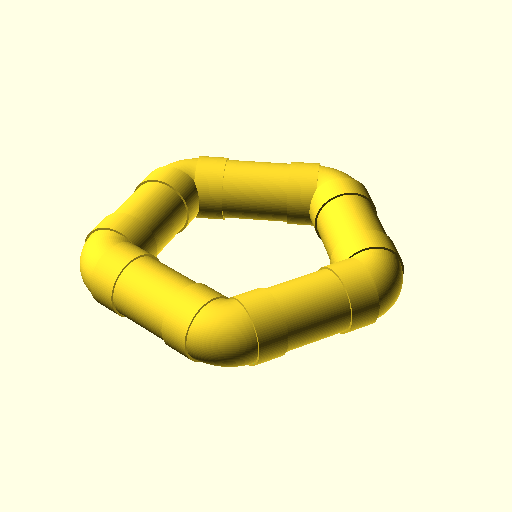
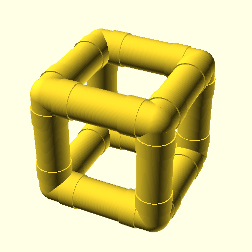

# Some Simple Examples

Here's some simple, simple examples of joining pipes and parts together. They're made with the .scad files in this directory with the following:
```
openscad -D'$fn=100' -o <filename.png> <filename.scad>
```

I expect more will be added over time. 

## A four-sided loop



Four pipes, joined by four 90-degree elbows, that loops around to itself.

## A five-sided loop



Same thing as the four-sided loop, but with five sides whose elbows are 72-degrees.

## A cube



Eight corner pieces joined by twelve pipes into a cube.


